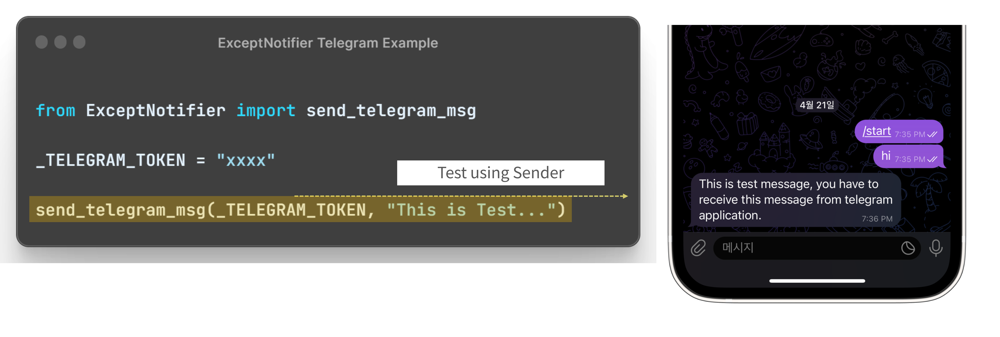

Development Status :: 3 - Alpha <br>
*Copyright (c) 2023 MinWoo Park, South Korea*<br>


<h5 align="center">Integrates AI-assisted debugging notifications into Python try-except statements for various messaging applications. </h5>

<p align="center">
<a></a>
<a href="https://pypi.org/project/exceptnotifier/"></a>
<a href="https://pepy.tech/project/exceptnotifier"></a>
<!-- <a></a> -->
<a href="https://github.com/psf/black"></a>
<!-- <a href="https://opensource.org/licenses/MIT"></a> -->
<a href="https://www.buymeacoffee.com/parkminwoo"></a>
</p>


##### Provides a notification from the application shown in the captured screen. 

# Python Package: ExceptNotifier [](https://hits.seeyoufarm.com) [](https://img.shields.io/badge/License-MIT-blue.svg) [](https://exceptnotifier.readthedocs.io/en/latest/)

 The ExceptNotifier Python package offers a flexible approach to receiving notifications by enhancing Python's try-except statement. This package enables you to receive alerts through various messaging applications or emails.
<Br><br>
With ExceptNotifier, you can obtain detailed compilation errors, including debug information, sent directly to your preferred messaging platform or email. By integrating OpenAI's ChatGPT, you can receive additional error code information as long as you provide the required API model name and key. This feature ensures that error handling and notifications are more informative and accessible, streamlining your debugging process.


<Br>
 
## Except Notifier Is All You Need.

### Although all explanations use the try-except block as an example, in reality, once overridden, it will send messages for exceptions that occurred without the try-except statement.

<br>
 
# Supporting Applications
Applicable to both [IPython](https://ipython.org/) and [Python](https://www.python.org/), but needs to be ported differently only in `ExceptNotifier`. Please refer to the detailed example. (`SuccessNotifier` and `SendNotifier` have the same syntax.)
- [Telegram](https://telegram.org/)
- [Discord](https://discord.com/)
- [Slack](https://slack.com/)
- [Google Mail](https://mail.google.com/)
- [Line](https://line.me/en/)
- [AWS Chime](https://aws.amazon.com/ko/chime/download-chime/)
- [Microsoft Teams](https://www.microsoft.com/en/microsoft-teams/download-app)
- [Kakao Talk](https://www.kakaocorp.com/page/service/service/KakaoTalk?lang=en)
- [Wecaht](https://www.wechat.com/)
- SMS Sending using [Twilio](https://www.twilio.com/en-us)
- Desktop Notification using [Plyer](https://github.com/kivy/plyer)
- Beep Sound from [system](https://docs.python.org/3/library/winsound.html)
- [Opea AI API](https://openai.com/blog/openai-api)
        - If you have OpenAI API Key and model name, you can get information and code examples for debugging in any application.
- [Google Bard](https://bard.google.com/) Python package [BardAPI](https://github.com/dsdanielpark/BARD_API)
        - Starting from Exceptnotifier version 0.2.5
        - Using the Python package [Bard API](https://github.com/dsdanielpark/BARD_API), if you declare the __Secure-1PSID value as a global variable , you can receive debugging hints and explanations about errors in your code through Google Bard.
<br>

# Install
The latest stable release (and required dependencies) can be installed from PyPI:
```
pip install ExceptNotifier
```

You may instead want to use the development version from Github:
```
pip install git+https://github.com/dsdanielpark/ExceptNotifier.git
```

<br><br><br>

# Contents

- [App Setup Overview](#app-setup-overview)
- [Tutorial](#tutorial)
<Br>

- [Python Core](#python-core)
  * [Except`Notifier`](#exceptnotifier)
    + [AI Debbugging Infomation Notification](#ai-debbugging-infomation-notification)
  * [Success`Notifier`](#successnotifier)
  * [Send`Notifier`](#sendnotifier)
  * [Sender](#sender)
<br>

- [IPython Core](#ipython-core)
  * [Except`Notifier` in Ipython](#exceptnotifier-in-ipython)
  * [Success`Notifier` in Ipython](#successnotifier-in-ipython)
  * [Send`Notifier` in Ipython](#sendnotifier-in-ipython)
  * [Sender in Ipython](#sender-in-ipython)
<br>

- [Applied in each application](#applied-in-each-application)
  * [*Telegram*](#telegram)
    + [a. Notifier without OpenAI API](#a-notifier-without-openai-api)
    + [b. Notifier with OpenAI API](#b-notifier-with-openai-api)
    + [c. Notifier with Google Bard API](#c-notifier-with-google-bard-api)
  * [*Mail*](#mail)
  * [*Discord*](#discord)
  * [*Chime*](#chime)
  * [*Slack*](#slack)
  * [*Line*](#line)
  * [*SMS*](#sms)
  * [*Teams*](#teams)
  * [*Kakaotalk*](#kakaotalk)
  * [*Wechat*](#wechat)
  * [*Beep*](#beep)
  * [*Desktop*](#desktop)
- [Contributing Guide](#contributing-guide)
- [License](#license)
- [Code of Conduct](#code-of-conduct)
- [Contacts](#contacts)

<br><br><br>


<br>

# App Setup Overview

- The variables in the following table must not be contaminated.
- Depending on the situation, consider designating them as global variables for use.
- As you already know, API Keys or security tokens must be secured. Note that the key values which exposured in github will be expired after insecured.
- We are trying to maintain the current architecture as much as possible by considering various methods such as inheriting decorators and Excepthook. We set it as an environment variable as follows, and we are refactoring and testing for a better method.

| App | Required Enviroment Variables | Free or Paid | Ease of Setup | Time Required for Setup|Guide Tutorial Link|
|:--:|:--|:--:|:--:|:--:|:---:|
|Beep|N/A|Free|N/A|0min|[ExceptBeep](./tutorials/ExceptBeep/GUIDE.md)|
|Desktop|N/A|Free|N/A|0min|[ExceptDesktop](./tutorials/ExceptDesktop/GUIDE.md)|
|Telegram|`_TELEGRAM_TOKEN`|Freemium|Easy|2min|[ExceptTelegram](./tutorials/ExceptTelegram/GUIDE.md) [](https://colab.research.google.com/drive/1jwWGs7eCUJQvj_g7SEMqm3a4Kdrp9ZQP?usp=sharing) |
|Discord|`_DISCORD_WEBHOOK_URL`|Freemium|Easy|1min|[ExceptDiscord](./tutorials/ExceptTelegram/GUIDE.md) [](https://colab.research.google.com/drive/1lwsIBpql_1zgEdIWRw6O_jBOZKJdHqBh?usp=sharing) |
|AWS Chime|`_CHIME_WEBHOOK_URL`|Freemium|Easy|1min|[ExceptChime](./tutorials/ExceptChime/GUIDE.md) [](https://colab.research.google.com/drive/1hUMMQ6He9M4MlspZ88J9kO8juxvC5b3a?usp=sharing)|
|Slack|`_SLACK_WEBHOOK_URL`|Freemium|Easy|3min|[ExceptSlack](./tutorials/ExceptSlack/GUIDE.md) [](https://colab.research.google.com/drive/1-dAaKl_gwX481FxH424aCVFqsq-thGXK?usp=sharing) |
|G-Mail|`_GAMIL_RECIPIENT_ADDR`, `_GMAIL_SENDER_ADDR`, `_GMAIL_APP_PASSWORD_OF_SENDER` |Restricted free|Medium|3min|[ExceptMail](./tutorials/ExceptMail/GUIDE.md) [](https://colab.research.google.com/drive/1IfDIliImFKG4UuM0yzerhubL_Kx_TFKF?usp=sharing)|
|Line|`_LINE_NOTIFY_API_TOKEN`|Freemium|Medium|4min|[ExceptLine](./tutorials/ExceptLine/GUIDE.md) [](https://colab.research.google.com/drive/1PDrJqxDq4NE6BRUrRkFvDBiMHQz0WbZh?usp=sharing) |
|SMS|`_TWILIO_SID`, `_TWILIO_TOKEN`, `_RECIPIENT_PHONE_NUMBER`, `_SENDER_PHONE_NUMBER`|Not free|Medium|5min|[ExceptSMS](./tutorials/ExceptSMS/GUIDE.md) [](https://colab.research.google.com/drive/13NuBhAxhwo67oc4jn3y8zpJiJrR-LHrP?usp=sharing)|
|Microsoft Teams|`_TEAMS_WEBHOOK_URL`|Not Free|Medium|5min|[ExceptTeams](./tutorials/ExceptTeams/GUIDE.md)|
|KakaoTalk|`_KAKAO_TOKEN_PATH`|Freemium|Hell|>=10min(Token refreshes daily)|[ExceptKakao](./tutorials/ExceptKakao/GUIDE.md)[](https://colab.research.google.com/drive/1E5Q-lnWStG1MqtnGCr5pzInlfWt2uc2S?usp=sharing)|


If you add the following two variables to the required variables for each application in the table above, you can receive error location and explanation, as well as examples, from OpenAI's model

| API | Required Variables | Free or Paid | Ease of Setup | Time Required for Setup|Guide Tutorial Link|
|:--:|:--|:--:|:--:|:--:|:---:|
| OpenAI API |`Required variables for each application`+ `_OPEN_AI_MODEL`,`_OPEN_AI_API`|Not free|Easy|2min|[APIOpenAI](./documents/OpenAI/GUIDE.md)|
| Google Bard API |`Required variables for each application`+ `_BARD_API_KEY`,`_BARD_ADVICE_LANG`|Free|Easy|1min|[Google Bard](./documents/GoogleBard/GUIDE.md)|

- Starting from v0.2.5, you can receive debugging hints and examples through Google Bard using the same syntax as the OpenAI API. However, due to time constraints, examples will only be added for Telegram and Discord.
- Starting from v0.2.6, you can receive debugging hints in Korean or Japanese by setting `_BARD_ADVICE_LANG` to 'ko' or 'jp'. The default language is english.
- Starting from v0.2.10, you can customize AI advice message by setting `_PROMPT_COMMAND` system variable.

<br>

# Tutorial
I will update tutorial ASAP. `README.md` is sufficient, but read the application's official documentation if necessary. However, we are preparing a more detailed and friendly tutorial.

1. Main-tutorials: [Notebook](https://github.com/DSDanielPark/ExceptNotifier/blob/main/tutorial/ExceptNotifier.ipynb)
2. Sub-tutorial-folder: Tutorials for each function can be found in this [folder](https://github.com/DSDanielPark/ExceptNotifier/tree/main/tutorial). The tutorial is synchronized with the Python file name provided by ExceptNotifier.

 **In this example, some API keys were exposed by creating and removing a test application, but for security reasons, your API key should not be exposed to the outside world.**

<Br>

# Python Core
To use the desired application, you must define the necessary variables. Ensure that the variable names remain unchanged, and you can use either local or global variables. If you are using `Telegram`, an example is attached as an image.


## Except`Notifier`

If you use Python's try except statement as it is, but change except as follows, you can receive notifications through your application.
- Format: Except`[appName]` <Br>
- Type: class
*ExampleClass*
```
ExceptChime, ExceptTelegram, ExceptDiscord, ExceptSMS, ExceptMail, ExceptKakao, ExceptLine, ExceptSlack, ExceptTeams, ExceptDesktope, ExceptBeep
```

*Example*
```python
import sys, os
from ExceptNotifier import ExceptTelegram
sys.excepthook = ExceptTelegram.__call__

os.environ['_TELEGRAM_TOKEN'] = "xxxx"

try:
    print(1/0)
except ExceptTelegram:    # sending except message to telegram
    sys.exit()
```


### AI Debbugging Infomation Notification


#### Using Open AI - Chat GPT 
You can receive debugging information from ChatGPT via OpenAI's API when using the Except statement. The syntax remains the same, but you'll need to configure these two variables:
`_OPEN_AI_MODEL`,`_OPEN_AI_API`

*Example*
```python
import sys, os
from ExceptNotifier import ExceptTelegram
sys.excepthook = ExceptTelegram.__call__

os.environ['_TELEGRAM_TOKEN'] = "xxxx"
os.environ['_OPEN_AI_MODEL']="gpt-3.5-turbo"
os.environ['_OPEN_AI_API']="sk-xxxxxx"

try:
    print(1/0)
except ExceptTelegram: # sending msg WITH AI DEBUGGING to telegram
    sys.exit()
```

#### Using Google - Bard 
You can receive debugging information from Google Bard via the python package [Bard API](https://github.com/dsdanielpark/BARD_API). you'll need to configure a variable:
`_BARD_API_KEY`<br>
(Optional) Google Bard officially supports Korean, so you can set the language of Bard Advice to Korean. Additionally, if `_BARD_ADVICE_LANG` is set to korean, debugging hints for code in Korean are provided. Just set a variable `_BARD_ADVICE_LANG` as 'ko'. Japanese is also supported. Set as 'jp'.

```python
from ExceptNotifier import ExceptTelegram, SuccessTelegram, SendTelegram
import sys, os
sys.excepthook = ExceptTelegram.__call__
os.environ['_TELEGRAM_TOKEN'] = "xxxxxxxxx"
os.environ['_BARD_API_KEY']="xxxxxxxxx"
# os.environ['_BARD_ADVICE_LANG']="ko"

try:
    print(1/0)  
    SuccessTelegram().__call__() #1. success sender          
except ExceptTelegram as e:      #2. except sender            
    sys.exit()

SendTelegram().__call__()        #3. customized sender     
```

## Success`Notifier`


- Format: Success`[appName]`
- Type: Class <br>
*ExampleClass* <br>
By placing the try except in python at the end of the try statement, applications can be notified that the try statement worked normally.
```
SuccessChime, SuccessTelegram, SuccessDiscord, SuccessSMS, SuccessMail, SuccessKakao, SuccessLine, SuccessSlack, SuccessTeams, SuccessDesktope, SuccessBeep
```
*Example*

```python
import sys, os
from ExceptNotifier import SuccessTelgeram
sys.excepthook = ExceptTelegram.__call__
os.environ['_TELEGRAM_TOKEN'] = "xxxx"

try:
    print(1/20)
    SuccessTelgeram().__call__()  # sending success message to telegram
except:
    sys.exit()
```

## Send`Notifier`

- Format: Send`[appName]` 
- Type: class <br>
*ExampleClass* <br>
Place it anywhere on the line of code you want, and you'll be notified when that line of code is reached.
```
SendChime, SendTelegram, SendDiscord, SendSMS, SendMail, SendKakao, SendLine, SendSlack, SendTeams, SendDesktope, SendBeep
```
*Example*

```python
import sys, os
from ExceptNotifier import SendTelegram
sys.excepthook = ExceptTelegram.__call__
os.environ['_TELEGRAM_TOKEN'] = "xxxx"

SendTelegram().__call__() # sending message to telegram

noti = SendTelegram()
noti()                    # sending message to telegram
```


## Sender

It is recommended to conduct a simple message sending test through the `sender`. Assuming that you can communicate with REST API or WEBHOOK normally, `ExceptNotifier` can work normally.
- Every application's ExceptNotifier uses the sender method.
- Format: send_`[appName]`_msg 
- Type: Function <br>
*Example* <br>
```
send_chime_msg, send_telegram_msg, send_discord_msg, send_sms_msg, send_gmail_msg, send_kakao_msg, send_line_msg, send_slack_msg, send_teams_msg, send_desktop_msg, beep
```
*Example*
```python
from ExceptNotifier import send_telegram_msg

send_telegram_msg(_TELEGRAM_TOKEN, "Any Test Message")
```

<br><br>


# IPython Core

> IMPORTANT:: In the case of IPython, the example is marked as except, but in fact, if you set it to set_custom_exc only once, a message will be sent even if an exception occurs in any cell from then on, even if it is not a try-except statement. Please refer to the following [article](https://dsdanielpark.github.io/package/2023-04-25-About_except_notifier.html).

You can use all the same except for the python code and `ExceptNotifier` mentioned above. In other words, the `SuccesNotifier`, `SendNotifier`, and `Sender` functions can all be used same in IPython without any special processing. Only `ExceptNotifier` is need to be defined.
- Example in Telegram [](https://colab.research.google.com/drive/1jwWGs7eCUJQvj_g7SEMqm3a4Kdrp9ZQP?usp=sharing) 

## Except`Notifier` in Ipython
You have to use `raise` in Ipython ExceptNotifier.
- Format: Except[appName]
- Type: function <br>

*Example code without Open AI API*


```python
from ExceptNotifier import ExceptTelegramIpython
import os
os.environ['_TELEGRAM_TOKEN'] = "xxxxx"
get_ipython().set_custom_exc((Exception,), ExceptTelegramIpython)

try:
  print(1/0)
except:
  raise
```

*Example code With Open AI API*


```python
from ExceptNotifier import ExceptTelegramIpython
import os
get_ipython().set_custom_exc((Exception,), ExceptTelegramIpython)

os.environ['_OPEN_AI_MODEL'] = "gpt-3.5-turbo"    
os.environ['_OPEN_AI_API'] = "sk-xxxxx"
os.environ['_TELEGRAM_TOKEN'] = "xxxxx"

try:
  print(1/0)
except:
  raise
```

## Success`Notifier` in Ipython

- Same syntax in Python. See Python Core above.
```python
import sys
import os
from ExceptNotifier import SuccessTelegram
os.environ['_TELEGRAM_TOKEN'] = "xxxxx"

try:
  print(1/20) # Your Code Here
  SuccessTelegram().__call__()    # Sending Success message
except:
  raise
```


## Send`Notifier` in Ipython


- Same syntax in Python. See Python Core above.
```python
import sys
import os
from ExceptNotifier import SendTelegram 
os.environ['_TELEGRAM_TOKEN'] = "xxxxx"

SendTelegram().__call__()         # Sending telegram message
```

## Sender in Ipython


- Same syntax in Python. See Python Core above.
```python
from ExceptNotifier import send_telegram_msg

_TELEGRAM_TOKEN =  "xxxxx"

send_telegram_msg(_TELEGRAM_TOKEN, "This is test message")
```

<br>

# Applied in each application

## Open AI - Chat GPT
You can receive debugging information from ChatGPT via OpenAI's API when using the Except statement. The syntax remains the same, but you'll need to configure these two variables:
`_OPEN_AI_MODEL`,`_OPEN_AI_API`

## Google - Bard
You can receive debugging information from Google Bard via the python package [Bard API](https://github.com/dsdanielpark/BARD_API) when using the Except statement. The syntax remains the same, but you'll need to configure a variable:
`_BARD_API_KEY`<br><br>
(Optional) Google Bard officially supports Korean, so you can set the language of Bard Advice to Korean. Additionally, if `_BARD_ADVICE_LANG` is set to korean, debugging hints for code in Korean are provided. Just set a variable `_BARD_ADVICE_LANG` as 'ko'. Japanese is also supported. Set as 'jp'.

<br>

## *Telegram*
[](https://colab.research.google.com/drive/1jwWGs7eCUJQvj_g7SEMqm3a4Kdrp9ZQP?usp=sharing) 
As all classes function the same, the example will only use one image, like in Telegram.

- a. Open your telegram app and search for BotFather. (A built-in Telegram bot that helps users create custom Telegram bots) <br>
- b. Type /newbot to create a new bot <br>
- c. Give your bot a name & a username <br>
- d. Copy your new Telegram bot’s token <br>
- e. You have to click `Start_bot` and must enter anything to your bot.
   - Before use Notifier, Please use this to check if you follow guide. The Telegram bot may have a slight delay and it responded within 2-3 minutes. <br>


*API TEST*
```python
from ExceptNotifier import send_telegram_msg

_TELEGRAM_TOKEN = "xxxxx:xxxxx-xxxx"
send_telegram_msg(_TELEGRAM_TOKEN, 'msg')
```

For more infomation, visit [Telegram Bot Father API](https://core.telegram.org/bots/api)
<br><br>
 
##### This is a Python (*.py) example. If you are using IPython, please click the Google Colab icon above to view the example code.
 
### a. Notifier without OpenAI API
*Notifier*
```python
from ExceptNotifier import ExceptTelegram, SuccessTelegram, SendTelegram
import sys, os
sys.excepthook = ExceptTelegram.__call__
os.environ['_TELEGRAM_TOKEN'] = "xxxx"

try:
    print(1/0)  
    SuccessTelegram().__call__() #1. success sender          

except ExceptTelegram as e:      #2. except sender            
    sys.exit()

SendTelegram().__call__()        #3. customized sender     
```


### b. Notifier with OpenAI API
- If you just set `_OPEN_AI_API` and `_OPEN_AI_MODEL` environment variables in all application use case, AI MODEL will automatically send debugging information as a message. Currently, it is mainly based on the `GPT-3.5-TURBO` model, but we plan to update it so that other models can be used later.
*Notifier*
```python
from ExceptNotifier import ExceptTelegram, SuccessTelegram, SendTelegram
import sys, os
sys.excepthook = ExceptTelegram.__call__
os.environ['_TELEGRAM_TOKEN'] = "xxxx"
os.environ['_OPEN_AI_MODEL']="gpt-3.5-turbo"
os.environ['_OPEN_AI_API']="sk-xxxxxx"

try:
    print(1/0)  
    SuccessTelegram().__call__() #1. success sender          

except ExceptTelegram as e:      #2. except sender            
    sys.exit()

SendTelegram().__call__()        #3. customized sender     

```
<br>


### c. Notifier with Google Bard API
- Just set `_BARD_API_KEY`. If you would like to receive guidance in Korean, you can optionally set the following. Set `_BARD_ADVICE_LANG` as `ko` or `jp`.
*Notifier*
```python
from ExceptNotifier import ExceptTelegram, SuccessTelegram, SendTelegram
import sys, os
sys.excepthook = ExceptTelegram.__call__
os.environ['_TELEGRAM_TOKEN'] = "xxxxxxxxx"
os.environ['_BARD_API_KEY']="xxxxxxxxx"
# os.environ['_BARD_ADVICE_LANG']="ko"

try:
    print(1/0)  
    SuccessTelegram().__call__() #1. success sender          
except ExceptTelegram as e:      #2. except sender            
    sys.exit()

SendTelegram().__call__()        #3. customized sender     
```
<br>

## *Mail*
[](https://colab.research.google.com/drive/1IfDIliImFKG4UuM0yzerhubL_Kx_TFKF?usp=sharing)

In the except statement, an email is sent along with the error message. Additionally, you can send emails from any desired line. <br>
- a. Log in with the sender's email ID. <br>
- b. Obtain an app password for sending Google Mail at the following [link](https://myaccount.google.com/u/3/apppasswords?utm_source=google-account&utm_medium=myaccountsecurity&utm_campaign=tsv-settings&rapt=AEjHL4N2bMRWO46VaMp_jP06zQK14BWNPv66l2o59iJ99CkO8BjYnmoRUe9dtSchkkbubHZMUhevkAnwVJRHb9ygO3afispNlw) or [google document](https://support.google.com/accounts/answer/185833?hl=en). 

*API TEST*
```python
from ExceptNotifier import send_gmail_msg

_GMAIL_SENDER_ADDR = 'xxxx@gmail.com'
_GAMIL_RECIPIENT_ADDR = 'xxxx@gmail.com'
_GMAIL_APP_PASSWORD_OF_SENDER = 'xxxx'
subject_msg = "Test Title"
body_msg = "Test Body" 

send_gmail_msg(
    _GMAIL_SENDER_ADDR,
    _GAMIL_RECIPIENT_ADDR,
    _GMAIL_APP_PASSWORD_OF_SENDER,
    subject_msg,
    body_msg)
```
 
##### This is a Python (*.py) example. If you are using IPython, please click the Google Colab icon above to view the example code.
 
*Notifier*
```python
import sys, os
from ExceptNotifier import ExceptMail, SuccessMail, SendMail
sys.excepthook = ExceptMail.__call__

# Define the next two variables optionally when using OpenAI's API.
# os.environ['_OPEN_AI_MODEL']="gpt-3.5-turbo"    
# os.environ['_OPEN_AI_API']="sk-xxxxxx"
os.environ['_GAMIL_RECIPIENT_ADDR'] = 'xxxxxxx@gmail.com'
os.environ['_GMAIL_SENDER_ADDR'] = 'yyyyyy@gmail.com'
os.environ['_GMAIL_APP_PASSWORD_OF_SENDER'] = 'zzzzzz'

try:
    main()                      # Your Code Here
    SuccessMail().__call__()    # No Exception -> Send Success mail.
except ExceptMail:              # Exception -> Send Fail mail.
    pass

SendMail().__call__()           # When Process Ended -> Any Line mail.
```

<details>
<summary> See Example...</summary>

```python
import sys, os
from ExceptNotifier import ExceptMail, SuccessMail, SendMail

# Define the next two variables optionally when using OpenAI's API.
# os.environ['_OPEN_AI_MODEL']="gpt-3.5-turbo"    
# os.environ['_OPEN_AI_API']="sk-xxxxxx"
os.environ['_GAMIL_RECIPIENT_ADDR'] = 'xxxxxxx@gmail.com'
os.environ['_GMAIL_SENDER_ADDR'] = 'yyyyyy@gmail.com'
os.environ['_GMAIL_APP_PASSWORD_OF_SENDER'] = 'zzzzzz'

sys.excepthook = ExceptMail.__call__

try:
    # 02.Locate your code
    print(1/0)   
    SuccessMail().__call__()   # Success Mail

except ExceptMail as e:        # Exception Mail       
    sys.exit()
    print(e)

SendMail().__call__()          # Put Any Line: Sending mail
```
</details>

<details>
<summary> Snippet for Python developers...</summary>

```python
import sys, os
from ExceptNotifier import ExceptMail, SuccessMail, SendMail
sys.excepthook = ExceptMail.__call__

# Define the next two variables optionally when using OpenAI's API.
# os.environ['_OPEN_AI_MODEL']="gpt-3.5-turbo"    
# os.environ['_OPEN_AI_API']="sk-xxxxxx"
os.environ['_GAMIL_RECIPIENT_ADDR'] = 'xxxxxxx@gmail.com'
os.environ['_GMAIL_SENDER_ADDR'] = 'yyyyyy@gmail.com'
os.environ['_GMAIL_APP_PASSWORD_OF_SENDER'] = 'zzzzzz'

try:
    'your code'
    SuccessMail().__call__()
except ExceptMail:
    pass

SendMail().__call__() 
```
</details>

<br>

## *Discord*
[](https://colab.research.google.com/drive/1lwsIBpql_1zgEdIWRw6O_jBOZKJdHqBh?usp=sharing) 
- a. Select the channel to receive notifications.
- b. Click `Edit Channel` in the upper right corner of the chat window.
- c. Click `Integrations` - `Webhook` - `New Webhook`.
- d. Then click `Copy Webhook`.
 


*API TEST*
```python
from ExceptNotifier import send_discord_msg

send_discord_msg(_DISCORD_WEBHOOK_URL, "Any Test Message") 
```
 
##### This is a Python (*.py) example. If you are using IPython, please click the Google Colab icon above to view the example code.
 
*Notifier*
```python
import sys, os
from ExceptNotifier import ExceptDiscord, SuccessDiscord, SendDiscord
sys.excepthook = ExceptDiscord.__call__

# Define the next two variables optionally when using OpenAI's API.
# os.environ['_OPEN_AI_MODEL']="gpt-3.5-turbo"    
# os.environ['_OPEN_AI_API']="sk-xxxxxx"
os.environ['_DISCORD_WEBHOOK_URL'] = "xxxxxxxxxxxxxxxxx"


try:
    print(1/20)  
    SuccessDiscord().__call__() #1 success sender          
except ExceptDiscord as e:      #2 except sender            
    sys.exit()

SendDiscord().__call__()        #3 customized sender       
```

<br>

## *Chime*
[](https://colab.research.google.com/drive/1hUMMQ6He9M4MlspZ88J9kO8juxvC5b3a?usp=sharing)

- a. Select the Chat room to receive notifications.
- b. Click `Room Setting` in the upper right corner.
- c. Click `Manage Webhook and bot`
- d. Create Add Webhook, set it up, then click `Copy Webhook`.
 
*API TEST*
```python
from ExceptNotifier import send_chime_msg

send_chime_msg(_CHIME_WEBHOOK_URL, "Any Test Message")
```
 
##### This is a Python (*.py) example. If you are using IPython, please click the Google Colab icon above to view the example code.
 
*Notifier*
```python
import sys, os
from ExceptNotifier import SuccessChime, ExceptChime, SendChime
sys.excepthook = ExceptChime.__call__

# Define the next two variables optionally when using OpenAI's API.
# os.environ['_OPEN_AI_MODEL']="gpt-3.5-turbo"    
# os.environ['_OPEN_AI_API']="sk-xxxxxx"
os.environ['_CHIME_WEBHOOK_URL'] = "xxxxxxxxxxxxxxxxxx"


try:
    print(1/0)  
    SuccessChime().__call__() #1 success sender          
except ExceptChime as e:      #2 except sender            
    sys.exit()

SendChime().__call__()        #3 customized sender       
```
<br>

## *Slack*
[](https://colab.research.google.com/drive/1-dAaKl_gwX481FxH424aCVFqsq-thGXK?usp=sharing) 
- a. visit https://api.slack.com/
- b. `Create an app` - `From scratch` - `Create App`
- c. Add webhook: Click `Incoming Webhooks` - Activate Incomming `On` - Add New Webhook to Workspace
- d. Copy `Webhook URL`
 
*API TEST*
```python
from ExceptNotifier import send_slack_msg

send_slack_msg(_SLACK_WEBHOOK_URL, "Any Test Message")
```
 
##### This is a Python (*.py) example. If you are using IPython, please click the Google Colab icon above to view the example code.
 
 
*Notifier*
```python
import sys
from ExceptNotifier import ExceptSlack, SuccessSlack, SendSlack
sys.excepthook = ExceptSlack.__call__

# Define the next two variables optionally when using OpenAI's API.
# os.environ['_OPEN_AI_MODEL']="gpt-3.5-turbo"    
# os.environ['_OPEN_AI_API']="sk-xxxxxx"
os.environ['_SLACK_WEBHOOK_URL'] = 'https://hooks.slack.com/services/xxxxxxxxxxxxxxxxxxx'

try:
    print(1/0)  
    SuccessSlack().__call__() #1 success sender          
except ExceptSlack as e:      #2 except sender            
    sys.exit()

SendSlack().__call__()        #3 customized sender     
```
<Br>

## *Line*
[](https://colab.research.google.com/drive/1PDrJqxDq4NE6BRUrRkFvDBiMHQz0WbZh?usp=sharing) 
- a. Register [https://notify-bot.line.me/](https://notify-bot.line.me/)
- b. Go to mypage [https://notify-bot.line.me/my/](https://notify-bot.line.me/my/)
- c. Click `Generate Token`, enter Service Name and click `1-on-1 chat with LINE` (anything you like)
- d. Copy Token.

*API TEST*
```python
from ExceptNotifier import send_line_msg

send_line_msg(_LINE_NOTIFY_API_TOKEN:, "Any Test Message")
```
##### This is a Python (*.py) example. If you are using IPython, please click the Google Colab icon above to view the example code.
 
*Notifier*
```python
import sys
from ExceptNotifier import ExceptLine, SuccessLine, SendLine
sys.excepthook = ExceptLine.__call__

# Define the next two variables optionally when using OpenAI's API.
# os.environ['_OPEN_AI_MODEL']="gpt-3.5-turbo"    
# os.environ['_OPEN_AI_API']="sk-xxxxxx"
os.environ['_LINE_NOTIFY_API_TOKEN'] = 'xxxxxxxxxxx'

try:
    print(1/20)  
    SuccessLine().__call__() #1 success sender          
except ExceptLine as e:      #2 except sender            
    sys.exit()

SendLine().__call__()        #3 customized sender          
```

<Br>

## *SMS*
[](https://colab.research.google.com/drive/13NuBhAxhwo67oc4jn3y8zpJiJrR-LHrP?usp=sharing)

- a. Sign up for Twilio. [https://www.twilio.com/en-us](https://www.twilio.com/en-us)
- b. Click Console in the upper right corner.
- c. Copy the variables provided in the console.


*API TEST*
```python
from ExceptNotifier import send_sms_msg

_TWILIO_SID = 'xxxx'
_TWILIO_TOKEN = "xxxx"
_SENDER_PHONE_NUMBER = "xxxx"
_RECIPIENT_PHONE_NUMBER = "xxxx"

send_sms_msg(
    _TWILIO_SID,
    _TWILIO_TOKEN,
    _SENDER_PHONE_NUMBER,
    _RECIPIENT_PHONE_NUMBER,
    "Any Test Message")
```

##### This is a Python (*.py) example. If you are using IPython, please click the Google Colab icon above to view the example code.
 
*Notifier*
```python
import sys
from ExceptNotifier import ExceptSMS, SuccessSMS, SendSMS
sys.excepthook = ExceptSMS.__call__

# Define the next two variables optionally when using OpenAI's API.
# os.environ['_OPEN_AI_MODEL']="gpt-3.5-turbo"    
# os.environ['_OPEN_AI_API']="sk-xxxxxx"
os.environ['_TWILIO_SID'] = 'xxxx'
os.environ['_TWILIO_TOKEN'] = 'yyyyyy'
os.environ['_RECIPIENT_PHONE_NUMBER']="+aaaaaa",
os.environ['_SENDER_PHONE_NUMBER']="+bbbbbb",  

try:
    print(1/10)  
    SuccessSMS().__call__() #1 success sender          
except ExceptSMS as e:      #2 except sender
    sys.exit()

SendSMS().__call__()        #3 customized sender        
```
<Br>

## *Teams*
- a. Create the channel that you want to notify.
- b. `App` - `Search: webhook` - `Incoming Webhook` [https://teams.microsoft.com/l/app/203a1e2c-26cc-47ca-83ae-be98f960b6b2?source=app-details-dialog](https://teams.microsoft.com/l/app/203a1e2c-26cc-47ca-83ae-be98f960b6b2?source=app-details-dialog)
- c. Click `Request Approval` <br>
After you can use webhook incomming. Proceed to next steps.
Microsoft Teams allows limited application access per organization, so it can only be used if the webhook incoming application is available.
- c. Go to the team channel to receive notifications, and click `Connectors` in Settings.
- d. `Connectors` After configuring webhook incoming in Connector, copy the webhook URL.


*API TEST*
```python
from ExceptNotifier import send_teams_msg

_TEAMS_WEBHOOK_URL = 'xxxx'

send_teams_msg(_TEAMS_WEBHOOK_URL, "Any Test Message")
```
 
##### This is a Python (*.py) example. If you are using IPython, please click the Google Colab icon above to view the example code.

*Notifier*
```python
import sys
from ExceptNotifier import ExceptTeams, SuccessTeams, SendTeams
sys.excepthook = ExceptTeams.__call__

# Define the next two variables optionally when using OpenAI's API.
# os.environ['_OPEN_AI_MODEL']="gpt-3.5-turbo"    
# os.environ['_OPEN_AI_API']="sk-xxxxxx"
os.environ['_TEAMS_WEBHOOK_URL'] = 'microsoft webhook _TEAMS_WEBHOOK_URL'

try:
    print(1/20)  
    SuccessTeams().__call__() #1 success sender          
except ExceptTeams as e:      #2 except sender            
    sys.exit()

SendTeams().__call__()        #3 customized sender        
```

<Br>

## *Kakaotalk*

[](https://colab.research.google.com/drive/1E5Q-lnWStG1MqtnGCr5pzInlfWt2uc2S?usp=sharing)


- a. Sign up at the following site: [https://developers.kakao.com/](https://developers.kakao.com/)
- b. Click `My Application` on the top bar.
- c. Click `Add an application`, set a name, and create it.
- d. Click `Kakao Login` in the left menu, then change the State of `Kakao Login Activation` to ON on the resulting page.
- e. In `My Application > Product Settings > Kakao Login`, be sure to set `Redirect URI` as follows: [https://example.com/oauth](https://example.com/oauth)
- f. In the left Consent Items menu, set `Send message in KakaoTalk` to optional agreement.
- g. Copy the `REST API Key` in `My Application > App Settings > Summary`.
- h. If you have successfully completed all of the above steps, go to the following document and follow the instructions:
 ./tutorials/kakao_token_generator.ipynb

*API TEST*
```python
from ExceptNotifier import send_kakao_msg

_KAKAO_TOKEN_PATH = 'xxx/xx/xxx.json'

send_kakao_msg(_KAKAO_TOKEN_PATH, msg)
```
 
##### This is a Python (*.py) example. If you are using IPython, please click the Google Colab icon above to view the example code. 

*Notifier*
```python
import sys
from ExceptNotifier import ExceptKakao, SuccessKakao, SendKakao
sys.excepthook = ExceptKakao.__call__

# Define the next two variables optionally when using OpenAI's API.
# os.environ['_OPEN_AI_MODEL']="gpt-3.5-turbo"    
# os.environ['_OPEN_AI_API']="sk-xxxxxx"
os.environ['_KAKAO_TOKEN_PATH'] = 'xxxx/xxx/xxx.json''

try:
    print(1/0)  
    SuccessKakao().__call__() #1 success sender          
except ExceptKakao as e:      #2 except sender            
    sys.exit()

SendKakao().__call__()        #3 customized sender         
```


## *Wechat*
a. Get Webhook URL by visiting [here](https://work.weixin.qq.com/api/doc/90000/90136/91770) <br>
*API TEST*
```python
from ExceptNotifier import send_wechat_msg

send_wechat_msg(_WECHAT_WEBHOOK_URL, msg)
```
 
##### This is a Python (*.py) example. If you are using IPython, please click the Google Colab icon above to view the example code.
 
*Notifier*
```python
import sys
from ExceptNotifier import ExceptWechat, SuccessWechat, SendWechat

# Define the next two variables optionally when using OpenAI's API.
# os.environ['_OPEN_AI_MODEL']="gpt-3.5-turbo"    
# os.environ['_OPEN_AI_API']="sk-xxxxxx"
os.environ['_WECHAT_WEBHOOK_URL'] = "xxxxxxxxxxx"
sys.excepthook = ExceptWechat.__call__

try:
    print(1/0)  
    SuccessWechat().__call__() #1 success sender          
except ExceptWechat as e:      #2 except sender            
    sys.exit()

SendWechat().__call__()        #3 customized sender       
```

<Br>

## *Beep*
No setup is required. Use as follows. <br>
*TEST*
```python
from ExceptNotifier import beep

beep(sec=1, freq=1000) 
```
*Notifier*
```python
from Exceptnotifier import ExceptBeep, SuccessBeep, SendBeep(), beep()
os.environ['BEEP_TIME'] = 1
sys.excepthook = ExceptBeep.__call__

try:
    print(1/20)  
    SuccessBeep().__call__() #1 success beep-beep          

except ExceptBeep as e:      #2 except beep-beep                
    sys.exit()

SendBeep().__call__()        #3 customized beep-beep      

beep()

```

<Br>


## *Desktop*
No setup is required. Use as follows. <br>
*TEST*
```python
from ExceptNotifier import send_desktop_msg

title_msg = "Test Title"
body_msg = "Test Body"
DISP_TIME = 5

send_desktop_msg(title_msg, body_msg, DISP_TIME)
```
*Notifier*
```python
from ExceptNotifier import ExceptDesktop, SuccessDesktop, SendDesktop
sys.excepthook = ExceptDesktop.__call__
# Define the next two variables optionally when using OpenAI's API.
# os.environ['_OPEN_AI_MODEL']="gpt-3.5-turbo"    
# os.environ['_OPEN_AI_API']="sk-xxxxxx"

try:
    print(1/0)  
    SuccessDesktop().__call__() #1 success sender          

except ExceptDesktop as e:      #2 except sender            
    sys.exit()

SendDesktop().__call__()        #3 customized sender         
```

<br>


<Br><br><br>
 
# Documentation [](https://exceptnotifier.readthedocs.io/en/latest/)
 
Official Document: https://exceptnotifier.readthedocs.io/en/latest/ <br> 
Documentation can be automatically generated by [Sphinx](https://www.sphinx-doc.org/en/master/usage/quickstart.html). But, I do not use [Google style](https://google.github.io/styleguide/pyguide.html#383-functions-and-methods) because it requires [the Napoleon extension](https://sphinxcontrib-napoleon.readthedocs.io/en/latest/example_google.html) for Sphinx. I will use [m2r](https://github.com/miyakogi/m2r) to convert the README.md file to .rst so that it can be included.

Having generated it with Sphinx, we can also host the documentation freely at [ReadTheDocs.org](https://citation-graph.readthedocs.io/en/latest/). 
 
# License 
ExceptNotifier: MIT <br>
Licenses apply the each [dependencies package](https://choosealicense.com/licenses/), and the created posts follow [CC BY-NC-SA](https://creativecommons.org/licenses/by-nc-sa/4.0/).

# Bugs and Issues
Sincerely grateful for any reports on new features or bugs. Your valuable feedback on the code is highly appreciated.
[[Open a new issue]](https://github.com/dsdanielpark/ExceptNotifier/issues) 
 
# Contributing Guide
I will announce contributing rules when the code development status changes to beta soon. Until then, please create an issue for feature requests and bug reports. I would greatly appreciate it if you use it a lot and give your opinions generously. Thank you sincerely.

# Code of Conduct
Everyone participating in the `ExceptNotifier` project, and in particular in the issue tracker, pull requests, and social media activity, is expected to treat other people with respect and more generally to follow the guidelines articulated in [the Python Community Code of Conduct](https://www.python.org/psf/conduct/).

# Contacts
:mortar_board: Core maintainer: [Daniel Park, South Korea](https://github.com/DSDanielPark) <br>
:envelope: Email: parkminwoo1991@gmail.com <br>
- Developer note: [Link](./documents/DEV_NOTE.md)
#### Dev Note
1. Applying ExceptNotifier in Python

    In Python, we use [sys.excepthook](https://docs.python.org/ko/3/library/sys.html#sys.excepthook) to call the exceptnotifier by taking advantage of the interpreter calling sys.excepthook with three arguments (exception class, exception instance, traceback object) when an exception occurs. Since sys.excepthook is the highest-level exception handler that occurs just before the system shuts down, exceptnotifier is implemented as a class that inherits from baseexception and overrides sys.excepthook. For overriding exceptions that cannot be raised or exceptions raised in threads, please refer to the sys.unraisablehook() function and the threading.excepthook() function, respectively.

2. Application of ExceptNotifier in iPython

    Strictly, iPython is a package, not a programming language like Python, but it has been classified to aid understanding.
    IPython (Interactive Python) is a package consisting of a command shell for interactive computing for multiple programming languages.

    It is a very useful package that allows you to compile Python bit by bit in an interactive session through the concept of an interactive shell, but in iPython, control by sys.excepthook occurs just before the prompt is returned, so it is impossible to receive a traceback object using sys.excepthook and send an error message to each messenger app. Additionally, because it was necessary to inherit from baseexception, it was necessary to override other functions in iPython.

    Therefore, at first, we considered the [magics](https://ipython.readthedocs.io/en/stable/interactive/magics.html) in cell, but the problem of having to import the magic function every time in the cell can be cumbersome to use, so we decided to use the [set_custom_exc](https://ipython.readthedocs.io/en/stable/api/generated/IPython.core.interactiveshell.html) in iPython, which can work even by overriding it once. The set_custom_exc allows you to set a custom exception handler that is called when an exception in the exc_tuple occurs in the main loop (especially the run_code() method), and is designed so that the handle can return a structured traceback or None. Therefore, we can receive the traceback and send it to each messenger app. The order of top-level exception handling in iPython is different. You can use by `calling` raise in the `except` statement.

3. Using Environment Variables (environ)
    In Python's except statement, it was designed to inherit exceptionbase, so we thought about how to pass variables into the class and decided to set variables through os.environ to use them by distributing them as a package. Additionally, since the user's webhook URL or API key will not change, we named the variables in uppercase and set special names to prevent contamination from duplicate variables. Since the variables are used within the class, we added an underscore before the variable name.

4. About example code

    For explanation, in Python, the example uses the overrided `sys.excepthook` in the except statement, like `except ExceptTelegram as e:`. However, you can use it simply by overriding `sys.excepthook` once and calling `raise` in the `except` statement. In IPython, you can use `set_custom_exc` to override the `Exception` with a user-defined function once, and then call `raise` in the `except` statement to repeatedly take the desired ExceptNotifier action. Also, although the example uses` ExceptTelegram.__call__` or `SuccessTelegram().__call__()`, these are expressions to aid understanding, and you can change them to a more concise form if you prefer.

#### Could you kindly add this badge to your repository?
```

```

I would appreciate it if you could share the document widely by specifying that the source is the ExceptNotifier official github.

##### The package is currently in the development and QA stages, and the development stage will be updated at the top of this page. If it is determined that the product is stable through feature improvement, addition, and issue resolution, the development stage will reach stage 5. If no new updates or issues arise, it will be adjusted upward to stage 6 or higher.

